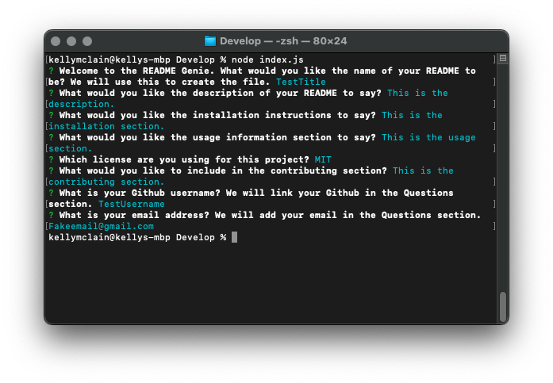
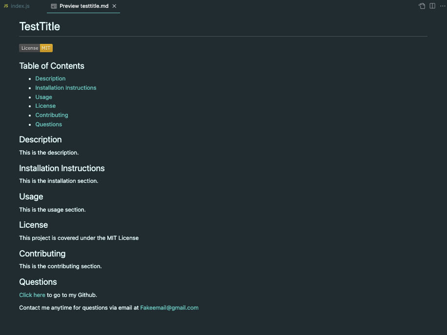

# :genie_man: README Genie :genie_man:

## Table of Contents

* [Description](#description)
* [Video Walkthrough](#video-walkthrough)
* [Installation](#installation)
* [Usage Instructions](#usage-instructions)
* [Credits](#credits)

## Description

Have you ever wanted to quickly type up a README for a project? This README Genie is for you! Answer a few questions and your README will be generated for you in milliseconds. If you do not answer a question, the README Genie will leave that section blank. 

## Video Walkthrough

[Click here](https://drive.google.com/file/d/13uErwDc3j9GDFtmnDyHeNHIp7fBhRZt0/view) to view a video walkthrough of the README Genie. 

## Screenshots

Here is an example of a filled out questionnaire in the terminal:  

  

Here is an exmple of the generated README from this filled out questionnaire:  

## Installation

`npm init`
  
`npm install inquirer`

## Usage instrutions

Run the following command in the root directory of your project. Answer the questions to generate a README which will be saved under the User_README folder:
  
`node index.js`